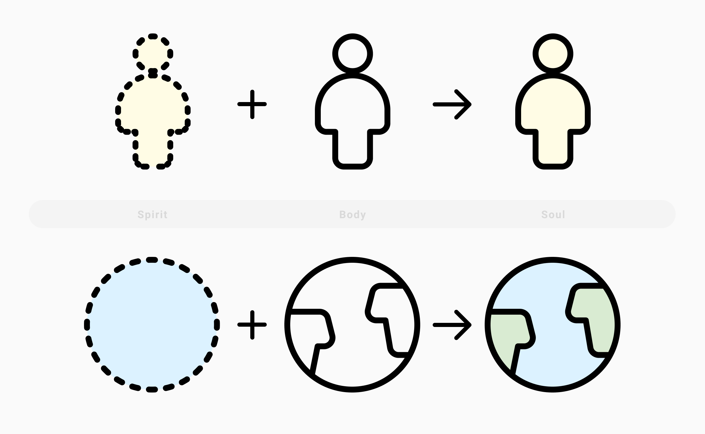

God teaches and instructs in numerous "mysterious ways". As Creator of heaven and earth, the natural world followed the pattern of creation that was used to create mankind. Thus, examining how the world operates can teach profound lessons about individual life. Alma taught it himself:

<Scripture
  title="Alma 30:44"
  link="https://www.churchofjesuschrist.org/study/scriptures/bofm/alma/30.p44?lang=eng#p44"
>
  44 ...yea, and all things denote there is a God; yea, even the earth, and all
  things that are upon the face of it, yea, and its motion, yea, and also all
  the planets which move in their regular form do witness that there is a
  Supreme Creator.
</Scripture>

One particularly profound example I find is between coral reefs and the spirit. This essay is an exploration in how much we share at an individual level with the macrocosm of coral structures that live under the ocean's surface.

## Parallels in the Creation of Earth and of Mankind

I'd like to focus on a few examples from the creation:

- the creation of the waters
- the separation of the dry land

And then compare those to their parallels in:

- the creation of our spirits
- the creation of our bodies

In the beginning God created the earth. On the third day of creation the waters were separated from the dry land:

<Scripture
  link="https://www.churchofjesuschrist.org/study/scriptures/ot/gen/1.9?lang=eng"
  title="Genesis 1:9"
>
  9 And God said, Let the waters under the heaven be gathered together unto one
  place, and let the dry land appear: and it was so.
</Scripture>

Earlier verses of Genesis 1 actually state that the waters were divided from the waters, explaining that on a later day the dry land appeared. In other words, the water came first.

A revelation to Joseph Smith in D&C 29 states that God created all things first spiritually.

<Scripture
  title="D&C 29:31-32"
  link="https://www.churchofjesuschrist.org/study/scriptures/dc-testament/dc/29.31-32?lang=eng"
>
  31 For by the power of my Spirit created I them; yea, all things both
  spiritual and temporal—
  <ScriptureBreak />
  32 <b>First spiritual, secondly temporal</b>, which is the beginning of my
  work; and again, first temporal, and secondly spiritual, which is the last of
  my work—
</Scripture>

By thinking about how things are first created spiritually, like our spirits before our bodies, the creation of earth and water appears to have some comparisons between the creation of body and spirit. Even as the waters were first brought forth, we existed and dwelled as spirits first before being gifted with a body.

A variety of prophets of the Church of Jesus Christ of Latter-day Saints [have stated](http://www.mormonthink.com/QUOTES/earth.htm) that the earth can be considered a living being. A similar idea referred to as the [Gaia hypothesis](https://en.wikipedia.org/wiki/Gaia_hypothesis) is a comparable concept from a less faith influenced background. The basis of the concept is that the earth acts and behaves harmoniously much like one living thing, similar to how all the cells and organelles of the body interact and support one another to live. According to the Gaia Hypothesis, the earth could be compared reasonably with the body.

All of these ideas combined lead me to thinking that an analysis in the context of the Creation is very pertinent, consider these points:

1. like the soul of man is comprised of 2 parts: [body and spirit](https://www.churchofjesuschrist.org/study/scriptures/dc-testament/dc/88.p15?lang=eng#p15), the earth is comprised 2 parts: land and sea
2. like mankind was created first spiritually before it was created physically, the creation of the earth kicked off with the waters (which can represent a spiritual side to the earth) and was followed up by the dry land (or physical aspect)

In the account of events from the life of Adam in the book of Moses, God even showed him that "both _above and beneath_: all things bear record of me":

<Scripture
  title="Moses 6:63"
  link="https://www.churchofjesuschrist.org/study/scriptures/pgp/moses/6.p63?lang=eng#p63"
>
  63 And behold, all things have their likeness, and{" "}
  <b>
    all things are created and made to bear record of me, both things which are
    temporal, and things which are spiritual
  </b>
  ; things which are in the heavens above, and things which are on the earth, and
  things which are in the earth, and things which are under the earth, <b>
    both above and beneath: all things bear record of me
  </b>.
</Scripture>

### Richness of what is below the surface

We live on the surface of earth that the God's divided from the seas to give beauty to the earth, the ocean we picture in our minds as an infinite expanse of placid water, and the beauty is deeper than surface level.

We see the variety in the earth's surface, the mountains, jungles, cities that dot the globe and make it beautiful, but the beauty of the ocean lives far out of sight.

What is happening beneath the surface that we should be aware of?

They are 1/10th of 1% of the ocean floor, but are home to more than 25% of marine life. (https://coral.org/coral-reefs-101/coral-reef-ecology/coral-reef-biodiversity/) and Blue Plant 2

## Warning Signs from Non-visible Sources

<Scripture
  title="How to Survive in Enemy Territory"
  link="https://www.churchofjesuschrist.org/study/new-era/2012/04/how-to-survive-in-enemy-territory.p14?lang=eng"
>
  No member of this Church—and that means each of you—will ever make a serious
  mistake without first being warned by the promptings of the Holy Ghost.
</Scripture>

## Protection and Cleansing the Inward Vessel

<Scripture
  title="Proverbs 23:7"
  link="https://www.churchofjesuschrist.org/study/scriptures/ot/prov/23.p7?lang=eng#p7"
>
  7 For as he thinketh in his heart, so is he: Eat and drink, saith he to thee;
  but his heart is not with thee.
</Scripture>

Earth's surface is much more resilient to heat because the ocean absorbs most of the heat that enters the atmosphere (93% of increased heat absorbed by the ocean since 1950).

Something surface level in our lives may not seem to heat up the surface, but somewhere below the surface, structures of support are affected. For example, if it weren't for the ocean absorbing heat, the earth would be 122 degrees Fahrenheit (http://www.alertdiver.com/Chasing_Coral). The impact of that is increases in water temperatures of a few degrees that sounds negligible, but is enough to kill coral.

Coral is like our inward vessel, it's the deep level values we hold close that beautify ourselves but aren't as publicly evident. Our values, our commitment to the gospel, that is reflected at the surface level by the things we do. The first thing to feel the repurcussions of poor decisions in the surface level parts of our life, and a warning sign to change are those values. Even small changes in our hearts affects our lives.

<Scripture
  title="Jeremiah 31:33"
  link="https://www.churchofjesuschrist.org/study/scriptures/ot/jer/31.p33?lang=eng#p33"
>
  33 But this shall be the covenant that I will make with the house of Israel;
  After those days, saith the Lord, I will put my law in their inward parts, and
  write it in their hearts; and will be their God, and they shall be my people.
</Scripture>

The phrase ["whited sepulchres"](https://www.churchofjesuschrist.org/study/scriptures/nt/matt/23.p25-p27?lang=eng#p25) that Jesus used in reference to the Pharisees is particularly striking because of the appearance of coral when dying. In an effort to save itself, coral will expel the photosynthesizing algae from itself in a last-ditch effort to preserve itself. Ironically, it gives up its source of energy and often leads to the coral's death.

## Redemption and Rebirth
