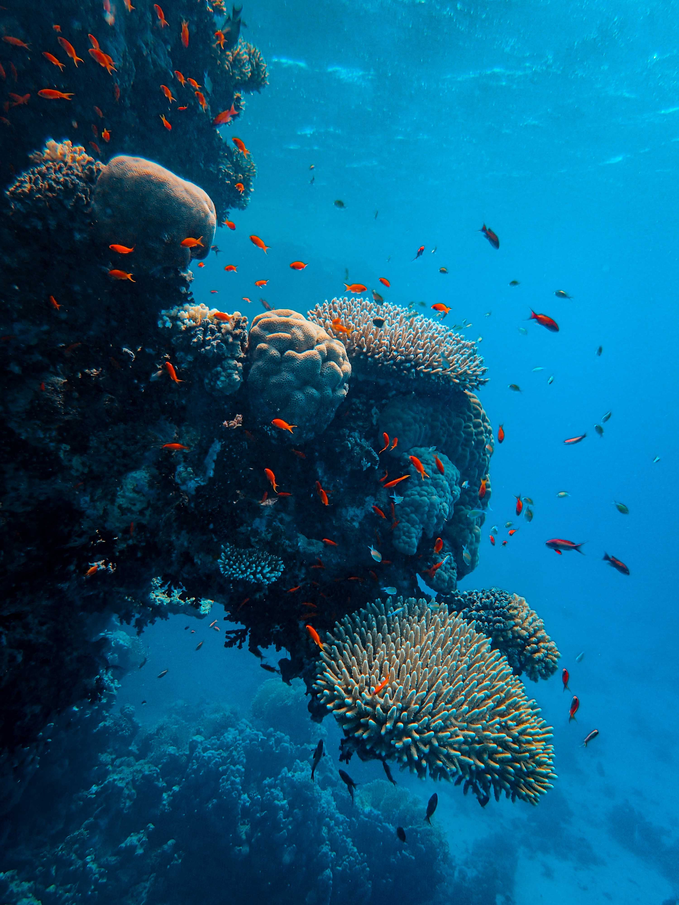

God teaches and instructs in numerous "mysterious ways". As Creator of heaven and earth, the natural world followed the pattern of creation that was used to create mankind. Thus, examining how the world operates can teach profound lessons about individual life. Alma taught it himself:

<Scripture
  title="Alma 30:44"
  link="https://www.churchofjesuschrist.org/study/scriptures/bofm/alma/30.p44?lang=eng#p44"
>
  44 ...yea, and all things denote there is a God; yea, even the earth, and all
  things that are upon the face of it, yea, and its motion, yea, and also all
  the planets which move in their regular form do witness that there is a
  Supreme Creator.
</Scripture>

One particularly profound example I find is between coral reefs and the spirit, or inward vessel. This essay is an exploration in how much we share at an individual level with the macrocosm of coral structures that live under the ocean's surface.

## Parallels in the creation of earth and of mankind

I'd like to focus on a few examples from the creation:

- the creation of the waters
- the separation of the dry land

And then compare those to their parallels in:

- the creation of our spirits
- the creation of our bodies

In the beginning God created the earth. On the third day of creation the waters were separated from the dry land:

<Scripture
  link="https://www.churchofjesuschrist.org/study/scriptures/ot/gen/1.9?lang=eng"
  title="Genesis 1:9"
>
  9 And God said, Let the waters under the heaven be gathered together unto one
  place, and let the dry land appear: and it was so.
</Scripture>

Earlier verses of Genesis 1 actually state that the waters were divided from the waters, explaining that on a later day the dry land appeared. In other words, the water came first; the order of operations is important.

A revelation to Joseph Smith in D&C 29 states that God created all things first spiritually.

<Scripture
  title="D&C 29:31-32"
  link="https://www.churchofjesuschrist.org/study/scriptures/dc-testament/dc/29.31-32?lang=eng"
>
  31 For by the power of my Spirit created I them; yea, all things both
  spiritual and temporal—
   
  32 <b>First spiritual, secondly temporal</b>, which is the beginning of my
  work; and again, first temporal, and secondly spiritual, which is the last of
  my work—
</Scripture>

By thinking about how things are first created spiritually, like our spirits before our bodies, the creation of earth and water appears to have some comparisons between the creation of body and spirit. Even as the waters were first brought forth, we existed and dwelled as spirits first before being gifted with a body.

A variety of prophets of the Church of Jesus Christ of Latter-day Saints [have stated](http://www.mormonthink.com/QUOTES/earth.htm) that the earth can be considered a living being. A similar idea referred to as the [Gaia hypothesis](https://en.wikipedia.org/wiki/Gaia_hypothesis) is a comparable concept from a less faith influenced background. The basis of the concept is that the earth acts and behaves harmoniously much like one living thing, similar to how all the cells and organs of the body interact and support one another to live. According to the Gaia Hypothesis, the earth could be compared reasonably with the body.

All of these ideas combined lead me to thinking that an analysis in the context of the Creation is very pertinent, consider these points:

1. like the soul of man is comprised of 2 parts: [body and spirit](https://www.churchofjesuschrist.org/study/scriptures/dc-testament/dc/88.p15?lang=eng#p15), the earth is comprised of 2 parts: land and sea
2. like mankind was created first spiritually before it was created physically, the creation of the earth kicked off with the waters (which can represent a spiritual side to the earth) and was followed up by the dry land (or physical aspect)

In the account of events from the life of Adam in the book of Moses, God even showed him that "both _above and beneath_: all things bear record of me":

<Scripture
  title="Moses 6:63"
  link="https://www.churchofjesuschrist.org/study/scriptures/pgp/moses/6.p63?lang=eng#p63"
>
  63 And behold, all things have their likeness, and{" "}
  <b>
    all things are created and made to bear record of me, both things which are
    temporal, and things which are spiritual
  </b>
  ; things which are in the heavens above, and things which are on the earth, and
  things which are in the earth, and things which are under the earth, <b>
    both above and beneath: all things bear record of me
  </b>.
</Scripture>

## Beauty below the surface

The ocean exists out of sight and out of mind, it's commonly cited that [humans know less about the bottom of the ocean than they do about space](https://www.nasa.gov/audience/forstudents/5-8/features/oceans-the-great-unknown-58.html). Fewer people have [made it to the Hadal Zone](https://en.wikipedia.org/wiki/Hadal_zone#Exploration) of the ocean (about 6000 meters deep) than have been to the moon.

It is easy to find beauty and variety in the earth's surface: the mountains, jungles, cities that dot the globe and make it beautiful, but the beauty of the ocean lives further from view. Coral reefs are exceptionally eye-catching, and on top of that are also incredibly important to the ocean and to the earth's surface.

Although coral reefs account for .01% of the ocean floor, they are home to [more than 25% of marine life](https://coral.org/coral-reefs-101/coral-reef-ecology/coral-reef-biodiversity/). It's remarkable that an almost negligible fraction of the ocean is home to so much of its biodiversity, and places a more significant weight on its role in the ecosystem it is a part of.

In 1 Corinthians, Paul compares the Church of Jesus Christ to a body, where all parts merit importance and play a different role.

<Scripture
  title="1 Corinthians 12:12"
  link="https://www.churchofjesuschrist.org/study/scriptures/nt/1-cor/12.12?lang=eng"
>
  12 For as the body is one, and hath many members, and all the members of that
  one body, being many, are one body: so also is Christ.
</Scripture>

The coral reefs of the ocean are another "member" of the earth, that like a body, relies on each member so "that the members should have the same care one for another".

## Coral reefs are the inward vessel

A synthesis of these ideas finally leads us to the central concept of this essay: **coral reefs are the inward vessel**.

Alma is the only recorded individual to use the phrase "inward vessel", and his words once again reinforce the importance of the order of operations.

<Scripture
  title="Alma 60:23"
  link="https://www.churchofjesuschrist.org/study/scriptures/bofm/alma/60.23?lang=eng#p23"
>
  23 Do ye suppose that God will look upon you as guiltless while ye sit still
  and behold these things? Behold I say unto you, Nay. Now I would that ye
  should remember that{" "}
  <b>
    God has said that the inward vessel shall be cleansed first, and then shall
    the outer vessel be cleansed also
  </b>
  .
</Scripture>

First the inward vessel needs to be cleansed, then the outer vessel can be. Recall other parallels where order matters:

- the waters were first divided, and then the dry land was brought forth
- the spirits that would come to earth were created, and then gifted with bodies

Jesus himself made a statement to the Pharisees of similar nature:

<Scripture
  title="Matt 23:25-26"
  link="https://www.churchofjesuschrist.org/study/scriptures/nt/matt/23.25-26?lang=eng#p25#25"
>
  25 Woe unto you, scribes and Pharisees, hypocrites! for ye make clean the
  outside of the cup and of the platter, but within they are full of extortion
  and excess.
   
  26 Thou blind Pharisee,{" "}
  <b>
    cleanse first that which is within the cup and platter, that the outside of
    them may be clean also.
  </b>
</Scripture>

In a quest for personal purity or cleansing, the recommended pattern is first in taking spiritual steps to change.

## Warning signs from non-visible sources

The Earth's surface is actually much more resilient to heat because of the ocean. The ocean absorbs most of the heat that enters the atmosphere, suppressing the warming phenomenom to those on the earth. If it weren't for the ocean absorbing heat, [the temperature on the surface of the earth would be around 122 degrees Fahrenheit](http://www.alertdiver.com/Chasing_Coral).

In this, the ocean protects the earth. Similarly, coral reefs protect land from tropical storms by breaking and limiting the effects of large waves, as well providing sources of food to fishers.

It is unfortunate when those structures of support crumble. As the ocean absorbs heat, coral can't survive, and as coral dies, the protecting influence it extends to the shoreline dies with it. If the ocean continues to warm there is a negative feedback loop, more coral dies, resulting in greater economic distress and environmental impact from tropical storms. The interconnectedness of body and spirit (and earth and ocean) show that one cannot be affected without the other bearing some of the consequences.

The more gradual warming of the ocean, and subsequent damage to coral, acts like a warning call. Similarly, Boyd K. Packer said that every person who has received the gift of the Holy Ghost has their own sort of spiritual warning call:

<Scripture
  title="How to Survive in Enemy Territory"
  link="https://www.churchofjesuschrist.org/study/new-era/2012/04/how-to-survive-in-enemy-territory.p14?lang=eng"
>
  No member of this Church—and that means each of you—will ever make a serious
  mistake without first being warned by the promptings of the Holy Ghost.
</Scripture>

The Holy Ghost may be out of sight, and (unfortunately) sometimes out of mind, but it _will_ warn us before we harm ourselves.

## Protection and cleansing the inward vessel

Our values and our commitment to the gospel that make up the inward vessel, are reflected on the surface of our lives by the things we do. Even small changes in our hearts affects our lives.

<Scripture
  title="Proverbs 23:7"
  link="https://www.churchofjesuschrist.org/study/scriptures/ot/prov/23.p7?lang=eng#p7"
>
  7 <b>For as he thinketh in his heart, so is he</b>: Eat and drink, saith he to
  thee; but his heart is not with thee.
</Scripture>

We ultimately become what we focus our attention on, think about, and desire. Cleansing the inward vessel is a function of turning our attention, thoughts, and desires to living God's laws.

<Scripture
  title="Jeremiah 31:33"
  link="https://www.churchofjesuschrist.org/study/scriptures/ot/jer/31.p33?lang=eng#p33"
>
  33 But this shall be the covenant that I will make with the house of Israel;
  After those days, saith the Lord, I will put my law in their inward parts, and
  write it in their hearts; and will be their God, and they shall be my people.
</Scripture>

By living and abiding by covenants we've made, God will write His law in our _inward parts_, helping cleanse us on the inside first.

## Redemption and rebirth

The phrase ["whited sepulchres"](https://www.churchofjesuschrist.org/study/scriptures/nt/matt/23.p25-p27?lang=eng#p25) that Jesus chooses to use in reference to the Pharisees is particularly striking because of the appearance of coral when dying.

Before it dies, coral will expel the photosynthesizing algae from itself in a last-ditch effort to preserve itself. That algae gives it its color and helps sustain it with nutrients. Ironically, by expelling the algae in an attempt to survive it gives up its source of energy and often leads to the coral's death.

But coral can grow back, and so can we. There was a plan prepared long before we ever came to earth that makes it possible to convert the stony, white memento mori back into something full of life. God even promised that He can "take away the stony heart" and replace it "with a heart of flesh":

<Scripture
  title="Ezekiel 36:26"
  link="https://www.churchofjesuschrist.org/study/scriptures/ot/ezek/36.26?lang=eng"
>
  26 A new heart also will I give you, and a new spirit will I put within you:
  and{" "}
  <b>
    I will take away the stony heart out of your flesh, and I will give you an
    heart of flesh
  </b>
  .
</Scripture>

There are all sorts of spiritual patterns that can be found in the world around us. In the journey to cleanse the inward vessel, coral is a truly beautiful example. I hope we all will be wary of spiritual warning signs that signify temporal danger, and address them by diving below the surface and _cleansing the inward vessel_.
